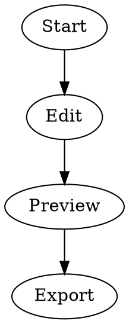

# Just Render the Graphviz, Please

A small, single-file Graphviz/DOT editor and renderer that works entirely in your browser. **Just Render the Graphviz, Please** is designed for quickly pasting, editing, previewing, and exporting Graphviz diagrams without installing Graphviz, creating an account, or sending your source code to a server.

Generated and human-reviewed by [Al Sweigart](https://inventwithpython.com/). The entire app is contained in one HTML file and works offline. You own it forever. No ads. No registration. No subscriptions. No trackers. Just right-click and save the `.html` page.

## Features

- Live DOT editor with line numbers
- Automatic Graphviz rendering as you type
- Layout engine selector
- Built-in examples
- Conservative **Tidy** formatter
- Pan and zoom preview
- Works offline after saving the HTML file

## Layout Engines

The layout dropdown provides these Graphviz engines:

- `dot`
- `neato`
- `fdp`
- `sfdp`
- `twopi`
- `circo`
- `osage`
- `patchwork`

`dot` is the default and is generally the best choice for hierarchical or directed graphs.

`neato`, `fdp`, and `sfdp` are useful for force-directed layouts, while the other engines provide radial, circular, clustered, or specialized layouts.

## Usage

Open `just-render-the-graphviz-please.html` in a modern web browser.

Enter DOT source in the editor:

The preview updates automatically.

Use the **Examples** dropdown to load sample graphs, or use **Open .dot** to load a local file.

Changing the layout dropdown immediately re-renders the graph with the selected Graphviz layout engine.

## Embedded Graphviz Runtime

The current build embeds:

- **Viz.js 1.7.1**
- **Graphviz 2.40.1**

The embedded library also contains third-party software with its own license notices. See the license header inside the HTML file for the complete notices.

The embedded library section is clearly marked in the source code so it can be removed if you want to create a smaller version that loads the renderer externally.

